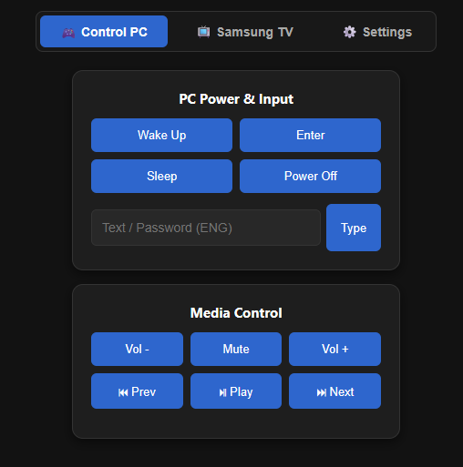
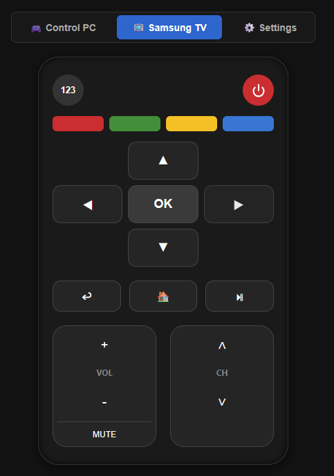
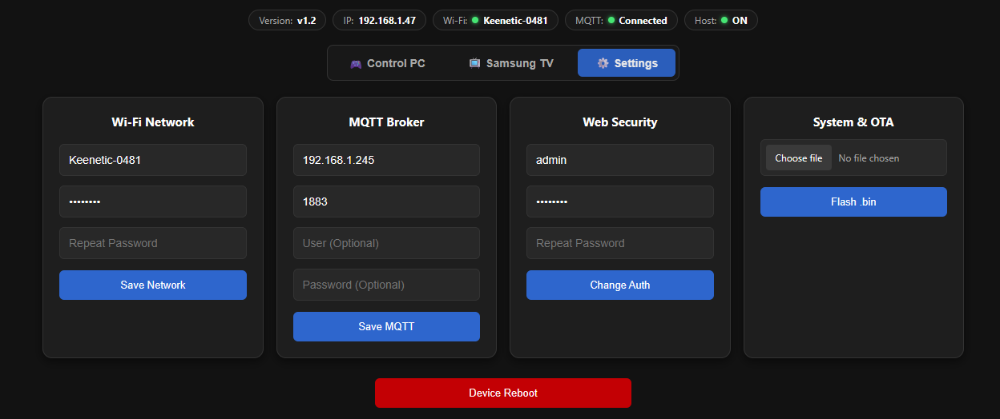
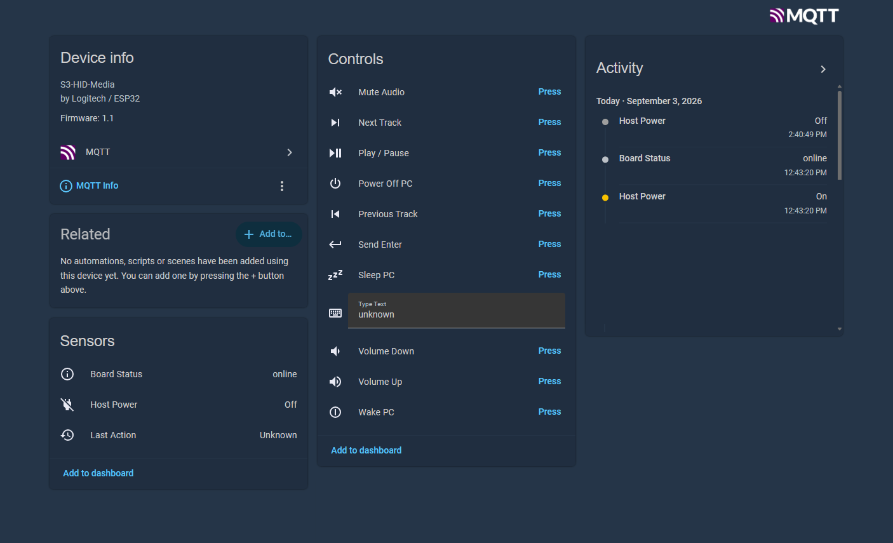

# ESP32-S3 Ultimate Controller (PC HID, ACPI, Мультимедиа и Samsung TV)

[🇺🇸 English](README.md) | [🇷🇺 Русский](README.ru.md)
---

Универсальный аппаратный USB-контроллер на базе **ESP32-S3** для управления электропитанием ПК (Сон, Пробуждение, Выключение), медиаплеером, телевизорами Samsung Smart TV, а также сетевой эмуляции устройств ввода (Клавиатура + Мышь). Обеспечивает полную интеграцию в **Home Assistant** (нативное MQTT Auto-Discovery) и автономное управление через веб-интерфейс.

Ключевое преимущество проекта — 100% надежное **аппаратное пробуждение ПК из режима глубокого сна ACPI S3 (Remote Wakeup)** с защитой стека TinyUSB от переполнения буфера при отключении или сне хоста.

---

## 🌟 Возможности (v1.2)

*   **Композитный USB HID (4-в-1):** Одновременная работа клавиатуры, мыши, медиа-пульта (Consumer Control) и контроллера питания ACPI через один физический USB-порт.
*   **Гарантированный Wake-on-USB:** Пробуждение компьютера шинным прерыванием (`Remote Wakeup`), кликом мыши и ACPI-сигналом.
*   **Виртуальный пульт Samsung TV:** Выделенная панель для управления смарт-ТВ (D-Pad стрелки, ОК, Назад, Главное меню, меню 123, цветные кнопки A/B/C/D, переключение каналов).
*   **Мониторинг статуса хоста (Host Power):** Аппаратное отслеживание подачи питания/активности USB-порта ПК или ТВ (бинарный сенсор `ON`/`OFF` в Home Assistant и веб-панели).
*   **Защита от зависаний:** Неблокирующая отправка пакетов (`tud_hid_ready()`). Плата никогда не зависнет при отправке команд в спящий или выключенный компьютер.
*   **Home Assistant MQTT Auto-Discovery:** Автоматическое добавление всех переключателей, поля ввода текста и сенсоров (Статус платы, Питание хоста, Последнее действие) без редактирования YAML.
*   **Умная светодиодная индикация (WS2812 RGB):** Динамическое автоопределение GPIO в зависимости от установленной платы (GPIO21 для Zero, GPIO48 для N16R8):
    *   🟠 **Оранжевый:** Загрузка / Переподключение к Wi-Fi.
    *   🔵 **Синий:** Wi-Fi подключен, идет подключение к MQTT.
    *   🟢 **Зеленый:** Система в сети и готова к работе.
    *   🔴 **Красный:** Режим точки доступа (AP) / Сброс настроек.
*   **Обновленный Web-интерфейс:** Три темных вкладки (Control PC, Samsung TV, Settings) с индикаторами статуса подключения (Версия, IP, Wi-Fi, MQTT, Host).
*   **Поддержка PlatformIO:** Готовые раздельные профили для моментальной сборки под 4MB/QSPI и 16MB/OPI.
*   **Безопасность и OTA:** Беспроводная прошивка бинарным файлом (`.bin`) через браузер и аппаратный сброс к заводским установкам (удержание BOOT на 5 секунд).

---

## 📸 Скриншоты

| Управление ПК | Пульт Samsung TV | Настройки | Home Assistant |
| :---: | :---: | :---: | :---: |
|  |  |  |  |

---

## 🛠 Совместимость с платами

*   **Waveshare ESP32-S3-Zero** (4MB Flash, 2MB QSPI PSRAM, светодиод на GPIO21).
*   **ESP32-S3-DevKitC-1 / N16R8** (16MB Flash, 8MB OPI PSRAM, светодиод на GPIO48).
    *   *Важно для плат N16R8:* Если RGB-диод не светится, замкните каплей припоя контактную перемычку с надписью `RGB` на плате.
*   **Подключение:** Кабель подключается строго в **нативный USB-порт** платы (маркируется как `USB`, а не `UART/COM`).

---

## 🚀 Сборка и прошивка

### Вариант 1: PlatformIO (Рекомендуемый)
1. Откройте папку проекта в VS Code с установленным расширением PlatformIO.
2. В нижней синей строке состояния выберите целевую плату:
   * `env:waveshare_zero` (для 4MB/2MB плат)
   * `env:esp32s3_n16r8` (для 16MB/8MB плат)
3. Нажмите кнопку **Build** (`✓`) или **Upload** (`➔`).

### Вариант 2: Arduino IDE
Используйте ядро **ESP32 версии 3.x+**:
* **Board:** `ESP32S3 Dev Module`
* **USB Mode:** `USB-OTG (TinyUSB)`
* **USB CDC On Boot:** `Disabled`
* **Partition Scheme:** `Minimal SPIFFS (1.9MB APP)` (для 4MB плат) или `16M Flash (3MB APP)` (для N16R8).
* **PSRAM:** `QSPI` (Zero) или `OPI` (N16R8).

---

## ⚙️ Первичный запуск

1. При первом включении (или при смене сети) плата поднимает сервисную точку доступа:
   * **SSID:** `ESP32-Setup-AP`
   * **Пароль:** `12345678`
2. Перейдите по адресу `http://192.168.4.1` (Логин/Пароль по умолчанию: `admin` / `wakeup123`).
3. На вкладке `Settings` укажите данные вашей сети **Wi-Fi** и адрес **MQTT-брокера**.

---

## 📡 MQTT Управление

### Топик команд: `pc/command`
*   **Управление ПК:** `wake`, `sleep`, `power`, `enter`.
*   **Мультимедиа:** `vol_up`, `vol_down`, `mute`, `play_pause`, `next`, `prev`.
*   **Samsung TV:** `tv_power`, `tv_123`, `tv_home`, `tv_back`, `tv_play`, `tv_ch_up`, `tv_ch_down`, `tv_up`, `tv_down`, `tv_left`, `tv_right`, `tv_enter`, `tv_a`, `tv_b`, `tv_c`, `tv_d`.

### Печать текста: `pc/type`
Передает входящую ASCII-строку напрямую в активное окно ОС (удобно для ввода паролей или выполнения терминальных команд).

### Топики обратной связи
*   `pc/status` — Доступность контроллера (`online`, `offline` через механизм MQTT LWT).
*   `pc/host_power` — Статус питания хоста (`ON` / `OFF`).
*   `pc/last_action` — Текст последней выполненной команды.

---

## 💻 Настройка Windows и BIOS для Wake-on-USB

1.  **BIOS/UEFI:** Включите опции *USB Wake Support*, *Always On USB* или *Power On By USB*.
2.  **Диспетчер устройств Windows:**
    *   В разделе **Клавиатуры** $\rightarrow$ `Logitech Total Keyboard V1.2` $\rightarrow$ **Свойства** $\rightarrow$ вкладка **Управление электропитанием**.
    *   Установите галочку **«Разрешить этому устройству выводить компьютер из ждущего режима»**.
    *   Проверьте аналогичную настройку в разделе **Мыши и иные указывающие устройства**.

---

## ⚖️ Лицензия
Проект распространяется под лицензией MIT.